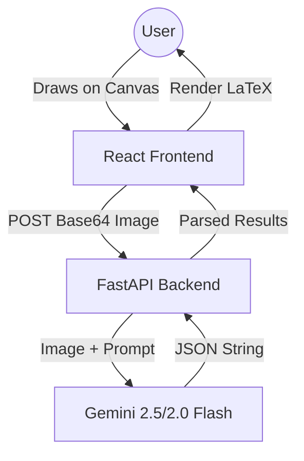

# AI Calculator - Technical Documentation

## 1. Project Overview
The AI Calculator is a full-stack application that allows users to solve mathematical expressions, equations, and graphical problems by drawing them on a digital canvas. The system uses Google Gemini's multimodal capabilities to analyze drawings and provide real-time solutions.

---

## 2. System Architecture

The application follows a client-server architecture:

- **Frontend (React + Vite + Mantine):** Handles user interactions, canvas drawing, and LaTeX rendering.
- **Backend (FastAPI + Uvicorn):** Manages API routing, image processing, and integration with the Google Generative AI (Gemini).

### Architecture Diagram


---

## 3. Detailed Component Flow

### 3.1 Frontend Logic (`screens/home/index.tsx`)
1.  **Canvas Interaction:** Uses HTML5 Canvas API to capture user strokes.
2.  **State Management:** Tracks drawing color, variables (`dictOfVars`), and generated results.
3.  **API Call:** When "Run" is clicked, the canvas is converted to a PNG Data URL (Base64) and sent to the backend.
4.  **LaTeX Rendering:** Uses `MathJax` to render the solution in a draggable overlay on top of the original drawing.

### 3.2 Backend Logic (`main.py` & `route.py`)
1.  **Entry Point:** `main.py` sets up the FastAPI app with CORS middleware and global exception handling.
2.  **Routing:** `route.py` receives the Base64 image, decodes it into bytes using `PIL` (Pillow), and passes it to the utility layer.
3.  **Global Exception Handling:** Ensures that even if the AI processing fails, the frontend receives a valid JSON error and maintains CORS compatibility.

### 3.3 AI Analysis Layer (`apps/calculator/utils.py`)
This is the core "intelligence" of the calculator.

1.  **Multimodal Prompting:** A detailed system prompt is sent along with the image. It instructs the model to solve 5 specific cases:
    - Simple expressions (e.g., 2+2)
    - Sets of equations (e.g., x + y = 5)
    - Variable assignments (e.g., x = 10)
    - Graphical word problems
    - Abstract concept detection
2.  **Model Selection & Fallback:**
    ```python
    # Primary: Latest high-performance model
    model = genai.GenerativeModel(model_name="gemini-2.5-flash")
    # Fallback 1: High-speed 2.0 series
    model = genai.GenerativeModel(model_name="gemini-2.0-flash")
    # Fallback 2: Stable legacy latest alias
    model = genai.GenerativeModel(model_name="gemini-flash-latest")
    ```
3.  **Output Parsing:** The model returns a string representing a Python list. The backend uses `ast.literal_eval` to safely convert this into a Python object before returning it to the frontend.

---

## 4. Theory & AI Logic

### 4.1 PEMDAS Rule
The system explicitly instructs Gemini to use the **PEMDAS** order of operations:
- **P**arentheses
- **E**xponents
- **M**ultiplication and **D**ivision (left to right)
- **A**ddition and **S**ubtraction (left to right)

### 4.2 Data Flow Lifecycle
1.  **Capture:** User draws `2 + 2`.
2.  **Transport:** `POST /calculate` sends `{ "image": "data:image/png;base64,...", "dict_of_vars": {} }`.
3.  **Cognition:** Gemini analyzes the pixels, recognizes the handwritten "2", "+", and "2", and calculates `4`.
4.  **Transformation:** Backend receives `[{'expr': '2+2', 'result': '4'}]`.
5.  **Visualization:** Frontend finds the center of the drawing and displays $2+2=4$ using LaTeX.

---

## 5. Security & Configuration
- **Environment Variables:** Sensitive data like `GEMINI_API_KEY` and `VITE_API_URL` are stored in `.env` files and never hardcoded in logic.
- **CORS Policy:** Allowed origins are restricted (currently `*` for development) to ensure the browser permits the frontend to talk to the backend.
